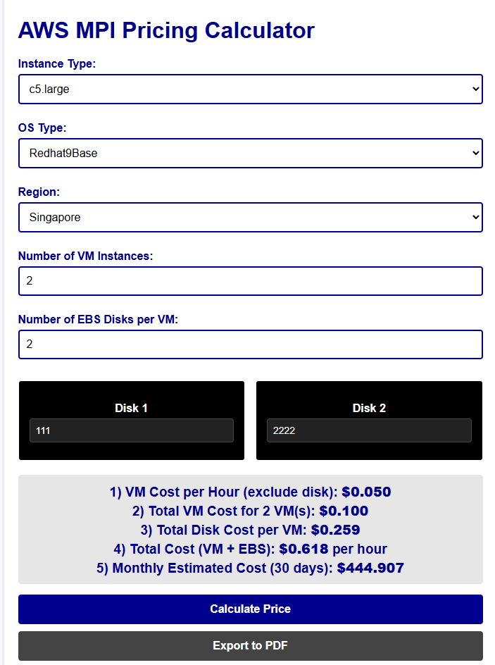

🚀 How to Run the Project Locally
This project is a static web app built with HTML, CSS, and JavaScript. It requires a local HTTP server to run properly due to browser restrictions (like CORS blocking CSV access via file://).

✅ Option 1: Using Python (Quickest)
If you have Python installed, follow these steps:

Open Terminal / Command Prompt

Navigate to your project folder (where index.html is):

bash
Copy
Edit
cd path/to/your/project
Example:

bash
Copy
Edit
cd Documents/Code/MPIcalculator/V7
Start a local server on port 8000:

bash
Copy
Edit
python -m http.server 8000
Open your browser and go to:

arduino
Copy
Edit
http://localhost:8000
✅ Option 2: Using VS Code + Live Server (Visual Method)
Open the project in Visual Studio Code

Install the Live Server extension from the Extensions tab

Right-click index.html → Open with Live Server

The browser will automatically launch your site.

## 📸 Demo Screenshot

